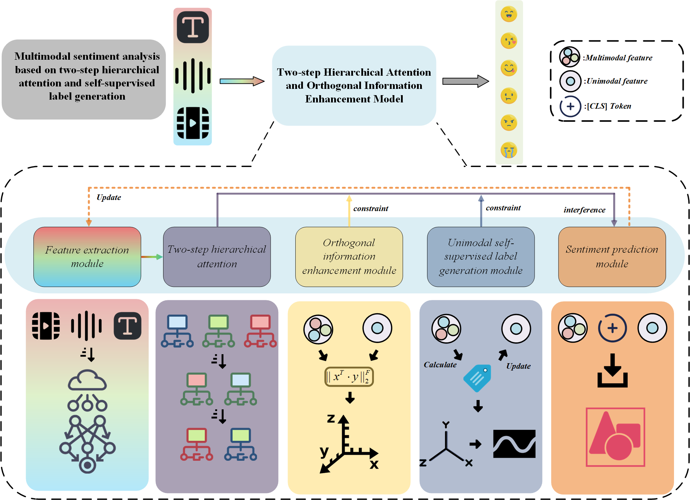

# Please Notice:
### Zhijia Zhang is the corresponding author affiliated with Shenyang University of Technology.
### Jian Fang is the corresponding author affiliated with Shenyang Institute of Automation, Chinese Academy of Sciences.

# TA-OEM
TA-OEM : Multimodal sentiment analysis using two-step hierarchical attention and self-supervised label generation.  


We propose the Two-step Hierarchical Attention and Orthogonal Information Enhancement Model to achieve multimodal sentiment analysis.


This paper is available at: https://www.sciencedirect.com/science/article/abs/pii/S0950705125021835




# Dataset
Our program reports the training results of the model on four datasets: CMU-MOSI, CMU-MOSEI, CH-SIMS, and IEMOCAP.


### *CMU-MOSI* and *CMU-MOSEI*
You can use this dataset from:   
https://github.com/CMU-MultiComp-Lab/CMU-MultimodalSDK  
or    
https://pan.baidu.com/s/169cCMoOyQ8Iry4DjXVchcg?pwd=6666

### *CH-SIMS*
You can use this dataset from:  
https://github.com/thuiar/ch-sims-v2

### *IEMOCAP*
You can use this dataset from:      
https://pan.baidu.com/s/16PqZuHgaNitDc_DyZJ480g?pwd=6666

# Train
You need to prepare Chinese and English BERT pretrained files and place them in the ```pretrain_data/bert_en``` or ```pretrain_data/bert_cn``` directories.   


The file structure should be organized as follows:
```
pretrain_data
   |--- bert_en
   |      |---bert_config.json
   |      |  ......
   |
   |--- bert_cn
   |      |---tokenizer.json
   |      |  ......
   |
```
You need to download the dataset files and place them in their corresponding folders under the ```data_set/``` directory.


The file structure should be organized as follows:
```
data_set
   |--- ch_simsv2
   |      |---ch-simsv2u.pkl
   |      |---unaligned.pkl
   |
   |--- IEMOCAP
   |      |---iemocap_data.pkl
   |      |---iemocap_data_noalign.pkl
   |      |  ......
   |
   |--- MOSEI
   |      |---train.pkl
   |      |---dev.pkl
   |      |---test.pkl
   |      | ......
   |
   |--- MOSI
   |      |---train.pkl
   |      |---dev.pkl
   |      |---test.pkl
   |      | ......
```

After installing the required libraries, you can directly run the ```run.py``` file to train the model. You can modify the dataset to run in the ```run.py``` file.   

By default, the model trains for 100 epochs. You can adjust the number of epochs in ```config.py```. After training, the model weights will be saved to the ```saves/save_model/``` directory.


# Cite:
If you find this work useful, please cite our paper:
```
@article{ZHANG2026115149,
title = {TA-OEM : Multimodal sentiment analysis using two-step hierarchical attention and self-supervised label generation},
journal = {Knowledge-Based Systems},
volume = {334},
pages = {115149},
year = {2026},
issn = {0950-7051},
doi = {https://doi.org/10.1016/j.knosys.2025.115149},
url = {https://www.sciencedirect.com/science/article/pii/S0950705125021835},
author = {Jiaming Zhang and Wenqiang Li and Zhijia Zhang and Jian Fang and Huaici Zhao}
}
```
